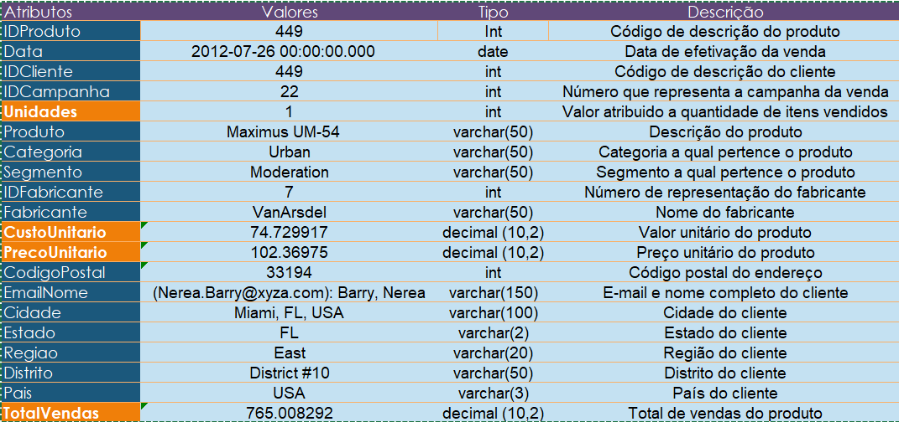
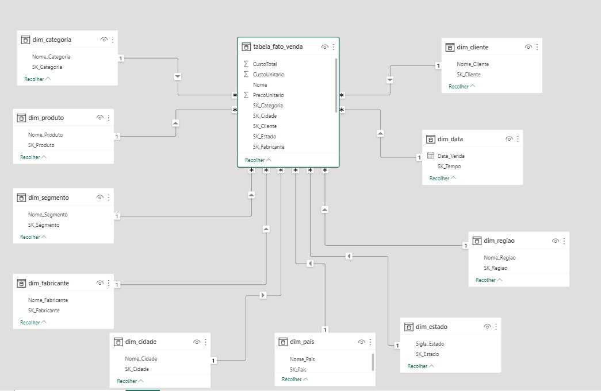

# 🚀 Desafio Data Engineering - DWE 2024

# Objetivo 
Realizar o pipeline de dados para fazer o ETL com objetivo de gerar dados íntegros para análise de dados e fomentar impacto, bem como agregar valor ao negócio.

---

# Transformação e Análise Exploratória (PYTHON).
A transformação dos dados e análise exploratória foi realizada em Python pela IDE Visual Studio Code, as principais bibliotecas são Pandas e Matplotlib para plotar os gráficos.

---
# Fonte de dados
A base de dados continha arquivo em *CSV* e posteriormente transformada em *Parquet*.

Foi disponibilizado um arquivo CSV nomeado de Vendas.csv, este contendo informações sobre vendas com 675368 linhas e 19 colunas.

No notebook contém todo o passo a passo das análises, tratamentos e merge das bases e extração dos dados.

# Tipos de dados
- CSV
- Parquet

## Camadas Medallion

- Bronze (Arquivo csv bruto)
- Silver (Arquivos transformados em formato Parquet)
- Gold (Arquivos prontos em para uso em formato Parquet)

- Silver (Arquivos transformados em formato Parquet)
- Gold (Arquivos prontos em para uso em formato Parquet)

A etapa bronze envolve a ingestão de dados brutos, a etapa silver envolve a limpeza e transformação dos dados brutos, a etapa gold envolve a agregação ou análise avançada dos dados limpos.

# Principais linguagens e ferramentas utilizadas
- Python (Pandas e PySpark)
- Linguagem SQL
- PowerBI e Linguagem DAX

# Legendas dos atributos

# Estrutura do banco de dados
A modelagem dos dados foi baseada no modelo dimensional Star Schema, pois tratá melhor performance nas consultas. A imagem abaixo contém a semântica estrutural do modelo.

# Regras de negócio
- Os valores vazios devem ser convertidos para "N/A".
- Não é possível conter valores duplicados
- O campo de preços devem ser sempre dados - float para auxiliar calculado em reais, sendo CustoUnitário e PrecoUnitario
- O nome dos atributos deve seguir a regra de separador com “Nome_Atributos”

# Perguntas de negócios 
Com a estruturação dos dados na camada Gold será possível realizar relatórios e dashboards capazes de responder às principais perguntas de negócios mencionadas abaixo que será possível medir os principais KPIs:

1. Qual o total de vendas?
2. Qual o custo total?
3. Qual o lucro total?

### Principais métricas de acompanhamento
- Total Vendas (R$)
- Total Custo (R$)
- Total Lucro (R$)

#### 🛠️ Desenvolvido por Naiara Gama

